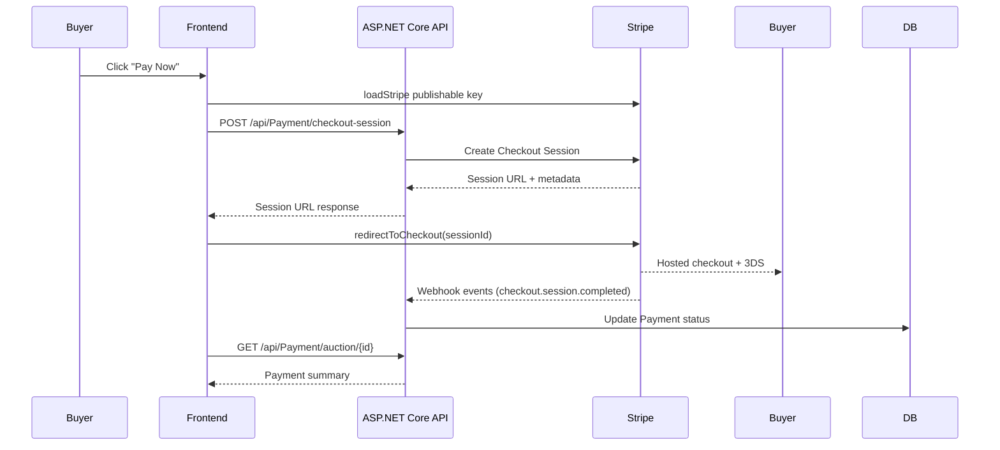

# Payments Playbook

## Sequence Overview

## Provider Decision Matrix
| Capability                | Stripe Checkout | Notes |
|---------------------------|-----------------|-------|
| Card payments             | ✅              | Hosted Checkout ensures PCI isolation. |
| Save payment methods      | ⚠️ Planned      | Requires future setup with Customer portal. |
| 3DS / SCA                 | ✅              | Handled transparently by hosted flow. |
| Alternative methods       | ⚠️ Planned      | Stripe Checkout supports expansion when enabled. |
| Refund management         | ✅ (backend)    | Initiated by sellers via backend dashboard. |

## Error Taxonomy
| Code         | Scenario                                      | UX copy |
|--------------|-----------------------------------------------|---------|
| auth         | Missing/expired JWT                           | "Please sign in again." |
| forbidden    | User not allowed to pay                       | "You are not allowed to pay for this auction." |
| conflict     | Duplicate payment attempt                     | "A payment attempt is already in progress." |
| not-found    | Auction/payment lookup failed                 | "We could not locate the payment record." |
| unsupported  | Adapter feature not available (e.g. refund)   | "Feature not supported yet." |
| server       | Generic backend/Stripe error                  | "Unable to process payment right now." |

## Testing Matrix
| Layer         | Tooling                  | Coverage |
|---------------|--------------------------|----------|
| Adapter/API   | Vitest unit tests        | Session ID parsing, error mapping |
| Hooks         | Vitest + RTL             | Adapter integration, telemetry emission |
| Components    | RTL smoke tests          | Status banner rendering |
| Manual        | Stripe test cards        | Success, 3DS challenge, decline flows |

## Integration Checklist
- [x] Stripe publishable key configured via `NEXT_PUBLIC_STRIPE_PUBLISHABLE_KEY`.
- [x] `SuccessUrl` points to `/orders/[id]` with `type=auction` fallback.
- [x] Cancel URL returns user to auction detail page with notification query.
- [x] Payment telemetry events emitted for init, request, failure, updates.
- [x] Documentation auto-refresh enforced through `scripts/update-system-guide.py`.

## References
- Tailwind components follow [Tailwind/07-styling-with-utility-classes.md](../../Tailwind/07-styling-with-utility-classes.md).
- React state patterns follow [React/36-managing-state.md](../../React/36-managing-state.md).
