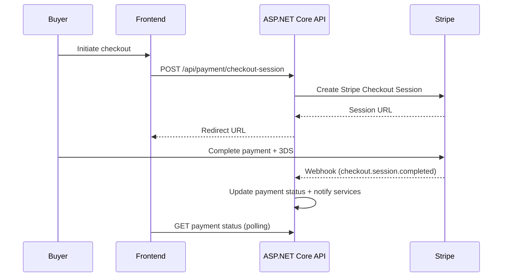

# System Guide

## Overview & Stack
- Frontend: Next.js 15.3.5 (App Router) with React ^19.0.0 and Tailwind CSS v4 via `@tailwindcss/postcss`.
- Backend: ASP.NET Core 8 Web API with Entity Framework Core and Stripe.NET integration.
- Tooling: TypeScript ^5, ESLint flat config, no default testing harness (payments introduces Vitest).
- Deployment: Docker compose templates available in `Backend/docker-compose.yml`.

## Frontend Architecture
**Routing**
- /(checkout)/checkout
- /(checkout)/orders/[id]
- /.
- /Profile/[id]
- /about
- /auction/[id]
- /categories/[categoryname]
- /forgotpassword
- /login
- /myShop
- /myShop/auctions
- /myShop/myProducts
- /myShop/notifications
- /signup
- /test

**State & Context**
- AuthContext
- NotificationContext
- ShopContext
- WebSocketContext

**Design Tokens (from `app/globals.css` — see `Tailwind`)**
- gold-start = #c69320
- gold-middle = #fcc201
- gold-end = #dba514
- radius = 0.625rem
- background = #f9f9f9
- foreground = #1e1e1e
- off-white = #fe33f4
- card = oklch(1 0 0)
- card-foreground = oklch(0.145 0 0)
- popover = oklch(1 0 0)

## Backend Architecture
**Controllers**
- HttpPost checkout-session
- HttpGet {id:guid}
- HttpGet bid/{bidId:guid}
- HttpGet auction/{auctionId:guid}
- HttpGet user/{userId:guid}
- HttpGet recent

**Services (`StripePaymentService` methods)**
- CreateCheckoutSessionForWinningBidAsync
- CreateRefundAsync
- FetchStripePaymentDetailsAsync
- TryHandleWebhookLiteAsync

## Payments Domain

State machine highlights: `Pending → Processing → Completed` with failure branches (`Failed`, `Refunded`, `Disputed`). Webhooks provide idempotent updates recorded in `WebhookEventLogs`.

## Security & Compliance
- PCI boundary: only Stripe Elements handles card data; backend stores Stripe IDs and metadata (no PAN).
- JWT auth protects payment APIs; rate limiting configured via `AspNetCoreRateLimit`.
- Webhook signatures validated with Stripe secret and configured tolerance.
- Avoid logging PII; use structured logs via ASP.NET Core `ILogger`.

## Test Strategy
- Unit: Adapter logic and utilities covered by Vitest with SDK mocks.
- Component: React Testing Library for forms, modals, and stateful flows.
- Integration: MSW interceptors emulate backend payment endpoints.
- Backend: Stripe webhook handlers exercised via application service tests (future work).

## Ops & Observability
- Observability: ASP.NET Core logging + Hangfire dashboard for jobs.
- Telemetry: Frontend emits analytics events via payment telemetry service (non-PII).
- Local reproduction: run backend via `dotnet run` and frontend via `npm run dev` in `Frontend/`.

## Conventions
- Coding style: TypeScript strict mode, React functional components, Tailwind utility classes.
- Commits: Conventional Commits (e.g., `feat:`, `docs:`).
- PRs: Provide summary, test plan, security notes, and doc references per payments playbook.

## Changelog
- 8cda19b - auto-update at 2025-09-27T11:34:04Z
